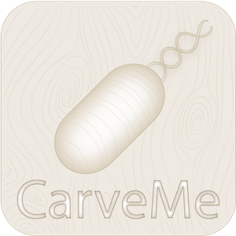

  

## Genome-scale metabolic model reconstruction with CarveMe

CarveMe is a python-based tool for genome-scale metabolic model reconstruction.

### Documentation

For instructions on installation and usage please check: http://carveme.readthedocs.io/
 
### Credits and License

For citation purposes please refer to our paper:

D. Machado et al, "Fast automated reconstruction of genome-scale metabolic models for microbial species and communities", Nucleic Acids Research, gky537, 2018. doi: https://doi.org/10.1093/nar/gky537

Developed at:
- European Molecular Biology Laboratory (2017-2019).
- Norwegian University of Science and Technology (Since 2020)

CarveMe is now an official service of ELIXIR Norway.

